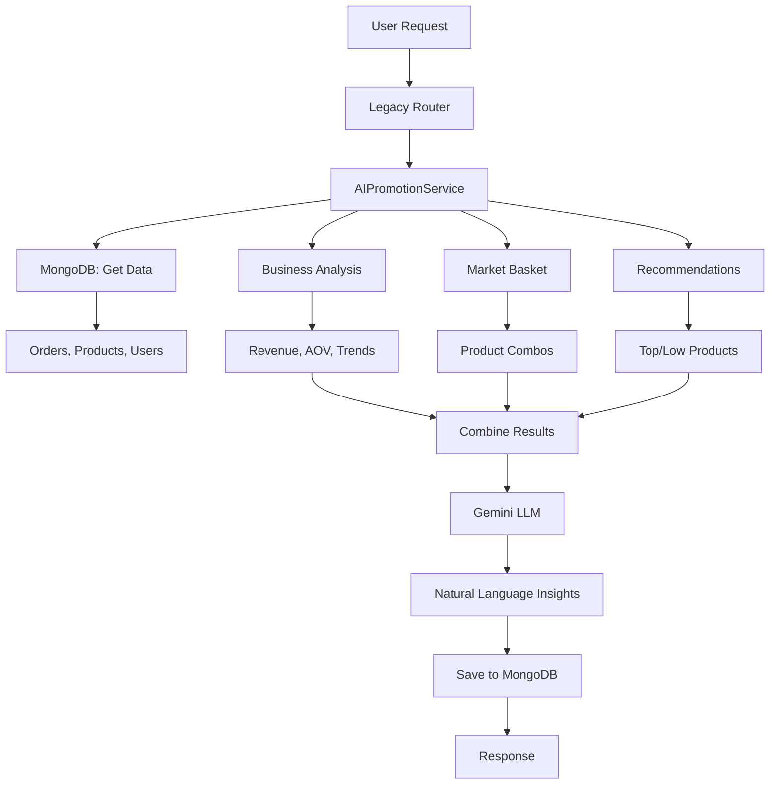

# 🔄 INTEGRATION FLOW DIAGRAM - RCM_PRICE

> **Visual Guide:** Mô tả luồng tích hợp giữa Flow cũ (Gemini LLM) và Flow mới (ML Weeks 1-6)

---

## 📊 OVERVIEW: CURRENT ARCHITECTURE

```
┌─────────────────────────────────────────────────────────────────────────┐
│                         FASTAPI MAIN APP                                 │
│                         (app/main.py)                                    │
├─────────────────────────────────────────────────────────────────────────┤
│                                                                           │
│   ┌─────────────────────┐              ┌─────────────────────┐          │
│   │   FLOW CŨ (LLM)     │              │   FLOW MỚI (ML)     │          │
│   │   Gemini 2.5 Pro    │              │   Weeks 1-6         │          │
│   └──────────┬──────────┘              └──────────┬──────────┘          │
│              │                                    │                      │
│              ↓                                    ↓                      │
│   ┌──────────────────────────────────────────────────────────┐          │
│   │            HYBRID RECOMMENDATION SYSTEM                   │          │
│   │  (Kết hợp TF + HuggingFace + Dynamic Pricing)           │          │
│   └──────────────────────────────────────────────────────────┘          │
│                              │                                           │
│                              ↓                                           │
│                    ┌─────────────────────┐                              │
│                    │   MongoDB Atlas     │                              │
│                    │   (Data Layer)      │                              │
│                    └─────────────────────┘                              │
└─────────────────────────────────────────────────────────────────────────┘
```

---

## 🔷 FLOW CŨ: GEMINI LLM PIPELINE

### Step-by-Step Flow

```
User Request: "Tạo chiến lược promotion"
        │
        ↓
┌───────────────────────────────────────────────────────────┐
│ ROUTER: app/routers/legacy.py                            │
│ POST /api/generate-strategy                              │
└───────────┬───────────────────────────────────────────────┘
            │
            ↓
┌───────────────────────────────────────────────────────────┐
│ SERVICE: application/services/ai_promotion_service.py    │
│                                                           │
│ Step 1: analyze_business_health()                        │
│   ├─ Get orders from MongoDB                             │
│   ├─ Calculate: revenue, AOV, daily trends               │
│   └─ Rank product performance                            │
│                                                           │
│ Step 2: discover_product_combos()                        │
│   ├─ Extract order transactions                          │
│   ├─ Apriori algorithm                                   │
│   └─ Association rules (support, confidence, lift)       │
│                                                           │
│ Step 3: generate_recommendations()                       │
│   ├─ Calculate popularity_score                          │
│   ├─ Top products (maintain)                             │
│   └─ Low-performing (need promotion)                     │
│                                                           │
│ Step 4: generate_llm_insights()  ← KEY FEATURE          │
│   ├─ Combine all ML results                              │
│   ├─ Create comprehensive prompt                         │
│   ├─ Call Gemini 2.5 Pro API                            │
│   └─ Parse JSON response                                 │
└───────────┬───────────────────────────────────────────────┘
            │
            ↓
┌───────────────────────────────────────────────────────────┐
│ GEMINI LLM (gemini-2.5-pro)                              │
│                                                           │
│ Input:                                                    │
│   - Business health metrics                              │
│   - Product combos                                       │
│   - Recommendations                                      │
│                                                           │
│ Process:                                                  │
│   - Analyze context                                      │
│   - Generate insights                                    │
│   - Create actionable strategies                         │
│                                                           │
│ Output:                                                   │
│   {                                                       │
│     "executive_summary": "...",                          │
│     "top_promotions": [...],                             │
│     "combo_strategies": [...],                           │
│     "timeline": {...},                                   │
│     "kpis": [...]                                        │
│   }                                                       │
└───────────┬───────────────────────────────────────────────┘
            │
            ↓
┌───────────────────────────────────────────────────────────┐
│ Save to MongoDB: ai_insights collection                  │
└───────────────────────────────────────────────────────────┘
            │
            ↓
        Response to User (Natural language insights)
```

### Data Flow Diagram



**Đặc điểm:**

- ✅ Qualitative insights
- ✅ Easy to understand
- ✅ Strategic recommendations
- ⚠️ Không có pricing specifics
- ⚠️ Không personalized by segment

---

## 🆕 FLOW MỚI: ML-BASED PRICING PIPELINE

### Complete ML Pipeline (Weeks 1-6)

```
User Request: "Tạo promotion cho NEW customers"
        │
        ↓
┌───────────────────────────────────────────────────────────┐
│ ROUTER: app/routers/smart_promotions.py                  │
│ POST /api/smart-promotions/generate-segment-promotion    │
└───────────┬───────────────────────────────────────────────┘
            │
            ↓
┌───────────────────────────────────────────────────────────┐
│ SERVICE: application/services/smart_promotion_service.py │
│                                                           │
│ await generate_segment_promotion(                        │
│     segment="NEW",                                        │
│     product_ids=[...],                                    │
│     goal="ACQUISITION"                                    │
│ )                                                         │
└───────────┬───────────────────────────────────────────────┘
            │
            ↓
┌───────────────────────────────────────────────────────────┐
│ WEEK 1: Price Elasticity Service                         │
│                                                           │
│ async def get_elasticity(product_id):                    │
│   ├─ Fetch historical orders                             │
│   ├─ Calculate price-demand relationship                 │
│   ├─ Compute elasticity coefficient                      │
│   └─ Return: elasticity = -0.85 (elastic)               │
└───────────┬───────────────────────────────────────────────┘
            │
            ↓
┌───────────────────────────────────────────────────────────┐
│ WEEK 2: Customer Segmentation Service                    │
│                                                           │
│ async def segment_customers():                           │
│   ├─ Calculate RFM (Recency, Frequency, Monetary)       │
│   ├─ K-Means clustering (6 clusters)                     │
│   ├─ Rule-based labeling                                 │
│   └─ Return: segments = {VIP: 3, NEW: 8, ...}          │
└───────────┬───────────────────────────────────────────────┘
            │
            ↓
┌───────────────────────────────────────────────────────────┐
│ WEEK 3-4: Personalized Pricing Service                   │
│                                                           │
│ async def calculate_personalized_price(product, user):  │
│   ├─ Get segment: "NEW"                                  │
│   ├─ Get elasticity: -0.85                              │
│   ├─ Apply rules: NEW = -14% discount                   │
│   ├─ Calculate: 260k * 0.86 = 223.6k                    │
│   └─ Return: personalized_price                         │
└───────────┬───────────────────────────────────────────────┘
            │
            ↓
┌───────────────────────────────────────────────────────────┐
│ WEEK 5: Pricing Simulator Service                        │
│                                                           │
│ async def simulate_strategy(scenario):                   │
│   ├─ Run Monte Carlo (n=1000 simulations)               │
│   ├─ Random factors: demand fluctuation                  │
│   ├─ Calculate revenue distribution                      │
│   └─ Return: mean_revenue, confidence_interval          │
└───────────┬───────────────────────────────────────────────┘
            │
            ↓
┌───────────────────────────────────────────────────────────┐
│ WEEK 6: Smart Promotion Generator                        │
│                                                           │
│ Process:                                                  │
│   1. Get pricing rules for "NEW" segment                │
│      → discount_pct = 0.14 (14%)                         │
│                                                           │
│   2. For each product:                                   │
│      ├─ base_price = 260,000 VND                         │
│      ├─ discounted = 260k * 0.86 = 223,600              │
│      └─ voucher_code = generate_random()                │
│                                                           │
│   3. Create promotion object:                            │
│      {                                                    │
│        "promotion_id": "PROMO_NEW_20251028",            │
│        "segment": "NEW",                                 │
│        "type": "DISCOUNT_PERCENTAGE",                   │
│        "value": 0.14,                                    │
│        "products": [                                     │
│          {                                               │
│            "product_id": "67643c2411d943b7bdecb7d3",    │
│            "base_price": 260000,                         │
│            "discounted_price": 223600,                   │
│            "savings": 36400,                             │
│            "voucher": "PROMO_ABC123"                     │
│          }                                               │
│        ],                                                │
│        "valid_until": "2025-11-27",                     │
│        "max_uses": 1                                     │
│      }                                                    │
└───────────┬───────────────────────────────────────────────┘
            │
            ↓
┌───────────────────────────────────────────────────────────┐
│ Save to MongoDB: promotions collection                   │
│ Cache in memory for fast retrieval                       │
└───────────────────────────────────────────────────────────┘
            │
            ↓
        Response to User (Structured JSON promotion)
```

### Data Flow Through ML Pipeline

```
MongoDB Data
    │
    ├──► Week 1: Price Elasticity
    │        └──► Elasticity coefficients
    │
    ├──► Week 2: Customer Segmentation
    │        └──► Customer segments (VIP/NEW/...)
    │
    ├──► Week 3-4: Personalized Pricing
    │        │      (Uses Week 1 + Week 2)
    │        └──► Personalized prices by segment
    │
    ├──► Week 5: Pricing Simulator
    │        │      (Uses Week 1-4)
    │        └──► Simulation results
    │
    └──► Week 6: Smart Promotions
             │      (Uses Week 1-5)
             └──► Final promotions with vouchers
```

**Đặc điểm:**

- ✅ Quantitative, data-driven
- ✅ Segment-specific pricing
- ✅ Statistical confidence (95% CI)
- ✅ Fully automated
- ⚠️ Thiếu qualitative insights
- ⚠️ Không có strategic context

---

## 🔶 HYBRID SYSTEM: INTEGRATION LAYER

### Current Hybrid Architecture

```
┌─────────────────────────────────────────────────────────────────┐
│           HYBRID RECOMMENDATION SYSTEM                           │
│           (application/services/hybrid_recommender.py)           │
├─────────────────────────────────────────────────────────────────┤
│                                                                   │
│   ┌──────────────┐     ┌──────────────┐     ┌──────────────┐   │
│   │ TensorFlow   │     │ HuggingFace  │     │  Dynamic     │   │
│   │ Recommenders │     │ Transformers │     │  Pricing     │   │
│   │              │     │              │     │              │   │
│   │ Collaborative│     │ Content-based│     │ Demand +     │   │
│   │ Filtering    │     │ Similarity   │     │ Elasticity   │   │
│   └──────┬───────┘     └──────┬───────┘     └──────┬───────┘   │
│          │                    │                    │            │
│          │  Weight: 0.4       │  Weight: 0.3       │  0.3       │
│          └────────────────────┴────────────────────┘            │
│                              │                                   │
│                              ↓                                   │
│                    ┌──────────────────┐                         │
│                    │ Ensemble Scoring  │                         │
│                    │ score = 0.4×CF +  │                         │
│                    │         0.3×CB +  │                         │
│                    │         0.3×DP    │                         │
│                    └──────────────────┘                         │
│                              │                                   │
└──────────────────────────────┼───────────────────────────────────┘
                               │
                               ↓
                    Combined Recommendations
```

### Integration Example: Get User Recommendations

```python
# Flow tích hợp hiện tại
async def get_user_recommendations(user_id: str):

    # 1. Collaborative Filtering (TF Recommenders)
    cf_recs = await tf_recommender.get_recommendations(user_id)
    # → Returns: [
    #     {"product_id": "prod_1", "score": 0.9},
    #     {"product_id": "prod_2", "score": 0.8}
    #   ]

    # 2. Content-based (HuggingFace)
    user_searches = await get_user_search_history(user_id)
    content_recs = await hf_filter.find_similar_products(user_searches)
    # → Returns: [
    #     {"product_id": "prod_3", "similarity": 0.85},
    #     {"product_id": "prod_1", "similarity": 0.75}
    #   ]

    # 3. Dynamic Pricing
    pricing_recs = await pricing_model.get_promotion_strategy()
    # → Returns: [
    #     {"product_id": "prod_2", "discount": 0.15},
    #     {"product_id": "prod_4", "discount": 0.10}
    #   ]

    # 4. Combine with weighted average
    combined = combine_recommendations(cf_recs, content_recs, pricing_recs)
    # → Returns: [
    #     {"product_id": "prod_1", "combined_score": 0.78},
    #     {"product_id": "prod_2", "combined_score": 0.72},
    #     ...
    #   ]

    return combined
```

**Điểm mạnh:**

- ✅ Kết hợp nhiều signals
- ✅ Weighted ensemble
- ✅ Diverse recommendations

**Điểm yếu:**

- ⚠️ Chưa tích hợp Week 1-6 ML models
- ⚠️ Chưa có LLM insights

---

## 🚀 PROPOSED: INTEGRATED ARCHITECTURE V2

### Enhanced Integration with Week 1-6 + LLM

```
┌─────────────────────────────────────────────────────────────────────────┐
│                    INTEGRATED STRATEGY SYSTEM V2                         │
├─────────────────────────────────────────────────────────────────────────┤
│                                                                           │
│  ┌────────────────────────────────────────────────────────────────┐     │
│  │                     DATA COLLECTION LAYER                       │     │
│  ├────────────────────────────────────────────────────────────────┤     │
│  │                                                                  │     │
│  │  ┌──────────┐  ┌──────────┐  ┌──────────┐  ┌──────────┐       │     │
│  │  │  Week 1  │  │  Week 2  │  │ Week 3-4 │  │  Week 5  │       │     │
│  │  │Elasticity│  │ Segments │  │  Pricing │  │Simulator │       │     │
│  │  └────┬─────┘  └────┬─────┘  └────┬─────┘  └────┬─────┘       │     │
│  │       │             │              │             │              │     │
│  │       └─────────────┴──────────────┴─────────────┘              │     │
│  │                           │                                      │     │
│  │                           ↓                                      │     │
│  │                  ┌─────────────────┐                            │     │
│  │                  │    Week 6       │                            │     │
│  │                  │  Promotions     │                            │     │
│  │                  └────────┬────────┘                            │     │
│  └───────────────────────────┼─────────────────────────────────────┘     │
│                              │                                            │
│                              ↓                                            │
│  ┌────────────────────────────────────────────────────────────────┐     │
│  │                   ANALYSIS & SYNTHESIS LAYER                    │     │
│  ├────────────────────────────────────────────────────────────────┤     │
│  │                                                                  │     │
│  │  ┌─────────────────────┐         ┌─────────────────────┐       │     │
│  │  │  ML Quantitative    │         │  LLM Qualitative    │       │     │
│  │  │  Analysis           │         │  Insights           │       │     │
│  │  ├─────────────────────┤         ├─────────────────────┤       │     │
│  │  │ • Elasticity data   │────────▶│ Input: ML results   │       │     │
│  │  │ • Segment profiles  │         │ • Elasticity        │       │     │
│  │  │ • Pricing matrix    │         │ • Segments          │       │     │
│  │  │ • Simulation results│         │ • Pricing           │       │     │
│  │  │ • Promotions        │         │ • Simulations       │       │     │
│  │  └─────────────────────┘         │ • Business health   │       │     │
│  │                                   │                     │       │     │
│  │                                   │ Process:            │       │     │
│  │                                   │ • Contextualize     │       │     │
│  │                                   │ • Explain           │       │     │
│  │                                   │ • Recommend         │       │     │
│  │                                   │                     │       │     │
│  │                                   │ Output:             │       │     │
│  │                                   │ • Executive summary │       │     │
│  │                                   │ • Action plan       │       │     │
│  │                                   │ • KPIs              │       │     │
│  │                                   └──────────┬──────────┘       │     │
│  └──────────────────────────────────────────────┼──────────────────┘     │
│                                                 │                        │
│                                                 ↓                        │
│  ┌────────────────────────────────────────────────────────────────┐     │
│  │                    INTEGRATED OUTPUT LAYER                      │     │
│  ├────────────────────────────────────────────────────────────────┤     │
│  │                                                                  │     │
│  │  {                                                               │     │
│  │    "ml_recommendations": {                                      │     │
│  │      "pricing_actions": [...],      ← Quantitative             │     │
│  │      "segment_strategies": [...],                              │     │
│  │      "simulation_results": [...]                               │     │
│  │    },                                                           │     │
│  │    "llm_insights": {                                            │     │
│  │      "executive_summary": "...",    ← Qualitative              │     │
│  │      "top_actions": [...],                                      │     │
│  │      "risks": [...]                                             │     │
│  │    },                                                           │     │
│  │    "action_plan": {                                             │     │
│  │      "immediate": [...],            ← Actionable               │     │
│  │      "this_week": [...],                                        │     │
│  │      "this_month": [...]                                        │     │
│  │    },                                                           │     │
│  │    "kpis": [...]                    ← Measurable               │     │
│  │  }                                                              │     │
│  └────────────────────────────────────────────────────────────────┘     │
│                                                                           │
└─────────────────────────────────────────────────────────────────────────┘
```

### V2 API Call Flow

```
User: POST /api/v2/generate-integrated-strategy
        │
        ↓
┌───────────────────────────────────────┐
│ 1. Fetch Week 1-6 ML Results         │
│    ├─ Price elasticity (all products)│
│    ├─ Customer segments               │
│    ├─ Personalized pricing matrix     │
│    ├─ Simulation results              │
│    └─ Active promotions               │
└───────────┬───────────────────────────┘
            │
            ↓
┌───────────────────────────────────────┐
│ 2. Fetch Business Analysis            │
│    ├─ Business health                 │
│    ├─ Product combos                  │
│    └─ Recommendations                 │
└───────────┬───────────────────────────┘
            │
            ↓
┌───────────────────────────────────────┐
│ 3. Combine All Data                   │
│    comprehensive_data = {             │
│      "ml_analysis": {...},            │
│      "business_analysis": {...}       │
│    }                                  │
└───────────┬───────────────────────────┘
            │
            ↓
┌───────────────────────────────────────┐
│ 4. Generate LLM Insights              │
│    Gemini 2.5 Pro receives:           │
│    - All Week 1-6 data                │
│    - Business context                 │
│    - Current state                    │
│                                       │
│    Returns:                           │
│    - Strategic recommendations        │
│    - Contextual explanations          │
│    - Risk assessment                  │
│    - Timeline                         │
└───────────┬───────────────────────────┘
            │
            ↓
┌───────────────────────────────────────┐
│ 5. Create Action Plan                 │
│    Combine ML + LLM:                  │
│    - Prioritize actions               │
│    - Set timelines                    │
│    - Define KPIs                      │
│    - Assign owners                    │
└───────────┬───────────────────────────┘
            │
            ↓
┌───────────────────────────────────────┐
│ 6. Save to MongoDB                    │
│    integrated_strategies collection   │
└───────────┬───────────────────────────┘
            │
            ↓
        Response: Integrated Strategy
```

---

## 🔄 FEEDBACK LOOP ARCHITECTURE

### Closed-Loop Learning System

```
┌────────────────────────────────────────────────────────────────────┐
│                         EXECUTION PHASE                             │
├────────────────────────────────────────────────────────────────────┤
│                                                                      │
│  Week 6 Promotions → Execute → Apply to Products → Customers Buy   │
│                                                                      │
└─────────────────────────────┬──────────────────────────────────────┘
                              │
                              ↓
┌────────────────────────────────────────────────────────────────────┐
│                      MONITORING PHASE                               │
├────────────────────────────────────────────────────────────────────┤
│                                                                      │
│  Track Metrics:                                                     │
│  ├─ Voucher usage rate                                             │
│  ├─ Revenue impact                                                  │
│  ├─ Conversion by segment                                           │
│  ├─ Customer satisfaction                                           │
│  └─ Time to purchase                                                │
│                                                                      │
└─────────────────────────────┬──────────────────────────────────────┘
                              │
                              ↓
┌────────────────────────────────────────────────────────────────────┐
│                       ANALYSIS PHASE                                │
├────────────────────────────────────────────────────────────────────┤
│                                                                      │
│  Compare:                                                           │
│  ├─ Predicted vs Actual demand                                     │
│  ├─ Estimated vs Real elasticity                                   │
│  ├─ Expected vs Achieved conversion                                │
│  └─ Simulated vs Real revenue                                      │
│                                                                      │
└─────────────────────────────┬──────────────────────────────────────┘
                              │
                              ↓
┌────────────────────────────────────────────────────────────────────┐
│                      MODEL UPDATE PHASE                             │
├────────────────────────────────────────────────────────────────────┤
│                                                                      │
│  Week 1: Update Elasticity                                         │
│  ├─ If prediction off by >10%: adjust elasticity coefficient       │
│  └─ Retrain with new data points                                   │
│                                                                      │
│  Week 2: Refine Segments                                           │
│  ├─ Update conversion rates by segment                             │
│  └─ Adjust segment boundaries if needed                            │
│                                                                      │
│  Week 3-4: Tune Pricing Rules                                      │
│  ├─ If discount too aggressive: reduce by 2%                       │
│  ├─ If conversion low: increase discount                           │
│  └─ Update segment pricing rules                                   │
│                                                                      │
│  Week 5: Improve Simulation                                        │
│  ├─ Update random distribution parameters                          │
│  ├─ Adjust confidence intervals                                    │
│  └─ Refine scenario probabilities                                  │
│                                                                      │
│  Week 6: Optimize Promotion Logic                                  │
│  ├─ Update discount thresholds                                     │
│  ├─ Adjust voucher validity periods                                │
│  └─ Refine bundling strategies                                     │
│                                                                      │
└─────────────────────────────┬──────────────────────────────────────┘
                              │
                              ↓
                    Back to EXECUTION PHASE
                    (with improved models)
```

### Example: Elasticity Update Flow

```
BEFORE (Week 1 Prediction):
  Product: Bánh hoa xuân
  Predicted elasticity: -0.85
  Price increase: 260k → 286k (+10%)
  Expected demand: -8.5% (from 100 to 91.5 units)

EXECUTE (Week 6):
  Apply promotion with price increase
  Voucher offsets 60% of increase

MONITOR (7 days later):
  Actual demand: 94 units (-6% instead of -8.5%)
  Revenue: Higher than expected

ANALYSIS:
  Error: 2.5 percentage points
  Reason: Elasticity was overestimated
  Actual elasticity: -0.60 (less elastic than thought)

UPDATE (Week 1 Model):
  Old elasticity: -0.85
  New elasticity: -0.60 ← Updated
  Confidence: Increased (more data points)

NEXT CYCLE:
  Better predictions for next price change
```

---

## 📊 COMPARISON TABLE

| Feature             | Flow Cũ (Gemini)        | Flow Mới (ML)                    | Integrated V2                |
| ------------------- | ----------------------- | -------------------------------- | ---------------------------- |
| **Data Input**      | Orders, Products, Users | Orders, Products, Users, Ratings | All + Historical Performance |
| **Processing**      | LLM analysis            | Statistical ML                   | ML + LLM                     |
| **Output Type**     | Natural language        | JSON numbers                     | Both                         |
| **Personalization** | Generic                 | Segment-specific                 | Individual-level             |
| **Precision**       | Qualitative             | Quantitative (2 decimals)        | Both                         |
| **Confidence**      | N/A                     | 95% CI                           | 95% CI + Reasoning           |
| **Actionability**   | Strategy-level          | Execution-level                  | End-to-end                   |
| **Learning**        | No                      | No (currently)                   | Yes (feedback loop)          |
| **API Latency**     | 5-10s (LLM)             | <1s                              | 5-10s                        |
| **Dependencies**    | Gemini API              | MongoDB                          | Both                         |
| **Best For**        | Strategic planning      | Tactical pricing                 | Complete solution            |

---

## 🎯 SUMMARY

### ✅ Điểm mạnh hiện tại:

1. Flow cũ (Gemini) tốt cho strategic insights
2. Flow mới (ML) tốt cho tactical execution
3. Hybrid system kết hợp recommendations

### ⚠️ Cần cải thiện:

1. LLM chưa dùng Week 1-6 data
2. Thiếu feedback loop
3. Thiếu unified API

### 🚀 Khuyến nghị:

Triển khai **Integrated Architecture V2** để tối đa hóa sức mạnh của cả 2 flows.

---

**Generated:** October 28, 2025  
**Next:** Implement Phase 1 (Enhanced LLM Integration)
